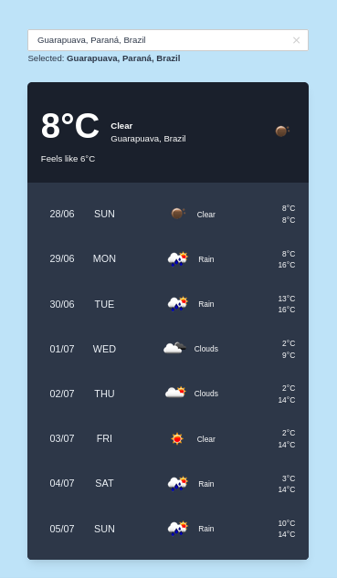

# Simple Weather App


<p align="center">
    
</p>

## Requeriments

* PHP >= 7.3
* Algolia Places API key
* Openweather API key

## Installation

* Install [Composer] (https://getcomposer.org/download) and [Npm] (https://nodejs.org/en/download)
* Clone the repository
* Access the repository folder: `cd simple-weather`
* Install the dependencies: `composer install && npm install && npm run production`
* Set environment variables: `cp .env.production .env`
* Configure the environment variables (MIX_ALGOLIA_APP_ID, MIX_ALGOLIA_APP_KEY and OPENWEATHER_API_KEY)
* Run `php artisan key: generate`
* Run `php artisan serve` to start the development server.
* Access in the browser: http://localhost:8000 or url that you configured.

## Tests

```
composer test
```
